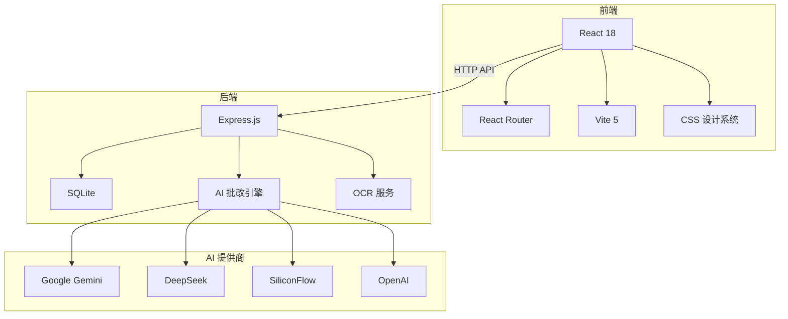

# 代码架构说明

## 一、项目结构

```
ai-homework-grader/
├── client/                    # 前端（React + Vite）
│   ├── src/
│   │   ├── components/        # 可复用组件
│   │   │   ├── Sidebar.jsx    # 侧边栏（含移动端抽屉 + 底部导航）
│   │   │   └── ScoreRing.jsx  # 分数环形动画组件
│   │   ├── pages/             # 页面组件
│   │   │   ├── Login.jsx      # 登录 / 注册
│   │   │   ├── TeacherDashboard.jsx  # 教师仪表盘
│   │   │   ├── StudentDashboard.jsx  # 学生仪表盘
│   │   │   ├── CreateAssignment.jsx  # 创建作业（含客观题编辑器）
│   │   │   ├── AssignmentDetail.jsx  # 作业详情
│   │   │   ├── SubmitAssignment.jsx  # 提交作业（含 OCR 上传）
│   │   │   └── GradingResult.jsx     # 批改结果展示
│   │   ├── App.jsx            # 路由 + 全局状态（AuthContext）
│   │   ├── main.jsx           # 应用入口
│   │   └── index.css          # 全局样式（设计系统 + 响应式）
│   ├── index.html
│   └── vite.config.js         # Vite 配置（含 API 代理）
│
├── server/                    # 后端（Node.js + Express）
│   ├── routes/
│   │   ├── auth.js            # 认证（注册 / 登录）
│   │   ├── assignments.js     # 作业 CRUD
│   │   ├── submissions.js     # 提交 + 混合批改引擎
│   │   ├── stats.js           # 统计数据
│   │   └── ocr.js             # OCR 图片上传与识别
│   ├── services/
│   │   ├── aiGrader.js        # 多模型 AI 批改（Gemini/DeepSeek/SiliconFlow/OpenAI）
│   │   └── ocrService.js      # Tesseract.js OCR 服务
│   ├── db.js                  # SQLite 数据库初始化与 Schema
│   ├── server.js              # Express 主入口
│   ├── .env                   # 环境变量配置
│   └── uploads/               # OCR 上传图片存储
│
└── docs/                      # 项目文档
```

---

## 二、技术栈



---

## 三、数据库设计

### 3.1 users 表

| 字段     | 类型        | 说明                    |
| -------- | ----------- | ----------------------- |
| id       | INTEGER PK  | 用户 ID                 |
| username | TEXT UNIQUE | 用户名                  |
| password | TEXT        | 加密密码（bcrypt）      |
| name     | TEXT        | 姓名                    |
| role     | TEXT        | 角色：teacher / student |

### 3.2 assignments 表

| 字段             | 类型       | 说明                |
| ---------------- | ---------- | ------------------- |
| id               | INTEGER PK | 作业 ID             |
| title            | TEXT       | 标题                |
| subject          | TEXT       | 科目                |
| description      | TEXT       | 主观题要求          |
| reference_answer | TEXT       | 参考答案            |
| questions_json   | TEXT       | 客观题（JSON 数组） |
| max_score        | INTEGER    | 满分                |
| created_by       | INTEGER FK | 创建教师            |

### 3.3 submissions 表

| 字段              | 类型       | 说明               |
| ----------------- | ---------- | ------------------ |
| id                | INTEGER PK | 提交 ID            |
| assignment_id     | INTEGER FK | 所属作业           |
| student_id        | INTEGER FK | 学生               |
| content           | TEXT       | 主观题答案         |
| objective_answers | TEXT       | 客观题答案（JSON） |

### 3.4 gradings 表

| 字段          | 类型       | 说明              |
| ------------- | ---------- | ----------------- |
| id            | INTEGER PK | 批改 ID           |
| submission_id | INTEGER FK | 对应提交          |
| score         | INTEGER    | 得分              |
| feedback      | TEXT       | 总体评价          |
| strengths     | TEXT       | 优点（JSON 数组） |
| weaknesses    | TEXT       | 不足（JSON 数组） |
| suggestions   | TEXT       | 建议（JSON 数组） |

---

## 四、核心模块说明

### 4.1 AI 批改引擎 (`services/aiGrader.js`)

```
请求 → detectProvider() → 选择提供商
                            ├── gradeWithGemini()
                            ├── gradeWithDeepSeek()
                            ├── gradeWithSiliconFlow()
                            └── gradeWithOpenAI()
        → parseResult() → 标准化输出
        → 异常时 fallback → generateMockGrading()
```

- **自动检测**：按 Gemini → DeepSeek → SiliconFlow → OpenAI 优先级
- **学科 Prompt**：8 学科差异化提示词
- **容错降级**：API 调用失败自动切换到模拟批改

### 4.2 混合批改引擎 (`routes/submissions.js`)

```
提交 → 判断题型
       ├── 纯客观题 → 模板匹配自动评分
       ├── 纯主观题 → AI 大模型批改
       └── 混合题型 → 40% 客观 + 60% 主观加权
```

### 4.3 OCR 服务 (`services/ocrService.js`)

- 使用 Tesseract.js（免费开源）
- 支持中文简体 + 英文混合识别
- 图片上传 → 文字提取 → 返回识别文本 + 置信度

### 4.4 前端状态管理 (`App.jsx`)

- **AuthContext**：全局用户认证状态
- **ToastContext**：全局消息提示
- JWT Token 存储在 localStorage
- 路由守卫：未登录自动跳转登录页

### 4.5 响应式设计 (`index.css`)

- 3 个断点：1024px（平板）/ 768px（手机）/ 400px（小屏）
- 移动端：侧栏变抽屉、底部导航栏、44px 最小触摸区域
- CSS 变量驱动的设计系统，方便主题切换
